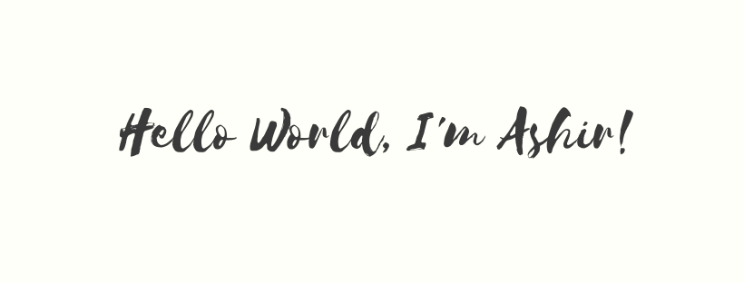

<h1 align="center">Hi, I'm Ashir 👋</h1>

🌟 Engineering student | 💻 Code Addict | 🌐 Open Source Enthusiast

---

<strong>⚡ About Me:</strong> 
I love turning ideas into reality with code. I’m on a mission to make open-source fun, friendly & approachable for all! 
Always tinkering, always learning. 🤖✨

<strong>🛠 Tech I Love:</strong> 
JS • Python • C++ • ROS2 • OpenCV • Git

<strong>🌍 Find Me Online:</strong>

<ul>
 <li>🚀 <a href="http://yumlux.live/" target="_blank">Building at Yumlux</a></li>
 <li>🧪 Tinkering on Codepen</li>
</li>
</ul>

---

Let’s create magic together 💫

