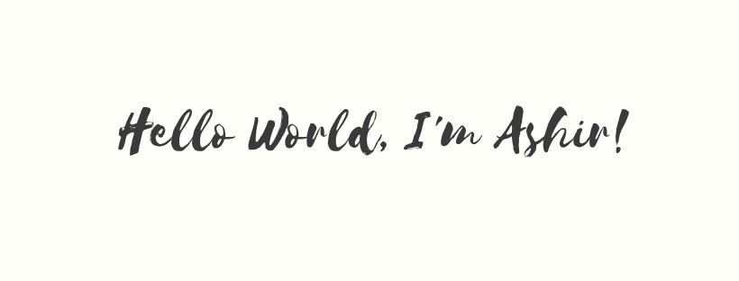

 

# Hi there, I'm Ashir 👋

### AI & Robotics Master's Student · Product Builder · Full-Stack Developer

 

 

---

### ⚡ About Me

<table>
<tr>
<td width="50%" valign="top">

**🎓 Currently Studying**
M.Sc. Autonomy Technologies (AI & Robotics)
@ FAU Erlangen-Nürnberg

**🧭 Background**
Product Discovery · MVP Development · Full-Stack Engineering

</td>
<td width="50%" valign="top">

**💼 Past Roles**
- Digital Innovation Intern @ ZOLLHOF Tech Incubator
- Head of Technology @ Kite India
- Full Stack Web Developer @ Yumlux

**🎯 Mission**
Turning complex technical problems into real, usable products

</td>
</tr>
</table>

> 🔥 **Always building, always learning.**

I bridge product thinking and engineering — from running 20+ stakeholder interviews to shipping the code myself. I've led cross-functional teams, launched an AI-driven Asset Optimizer for the Siemens Marketplace, and scaled a travel-tech platform to 9,000+ trip plans and 3,000+ global users.

---

### 💼 Experience Snapshot

- 🏭 **ZOLLHOF – Tech Incubator** — Led product discovery for an AI Asset Optimizer, from user research to a validated MVP
- ✈️ **Kite India** — Head of Technology; owned the full product lifecycle for an AI-based travel platform, leading a 20-member team
- 💻 **Yumlux** — Full Stack Web Developer; delivered 90+ client products with 98% on-time delivery
- 🖥️ **Start Nuremberg** — IT Team volunteer, building automation tools that cut repetitive work for 20+ teammates

---

### 🚀 Projects

- **IoT-based Firefighting Robot** — Unmanned emergency-response vehicle, cutting response time by 30%
- **IoT-based Garbage Monitoring System** — Arduino + cloud dashboard for sanitation teams, reducing workload by 20%

---

### 🛠 Tech I Love

---

### 🌍 Find Me Online

---

### 💫 Let's create magic together

Open to conversations on product, AI, and robotics — feel free to explore, star, or fork anything you find here!

